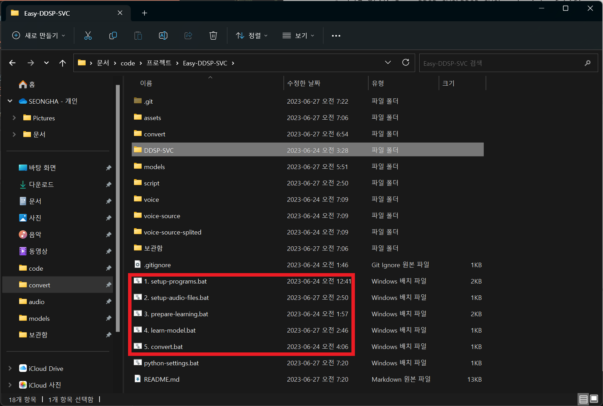
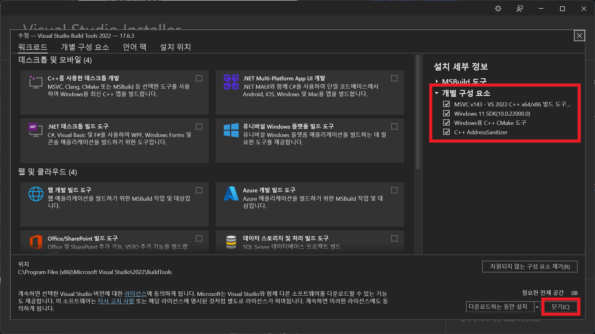
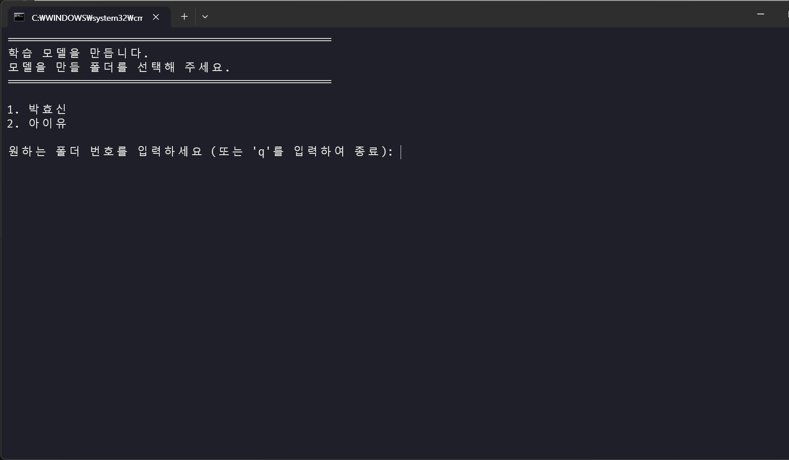
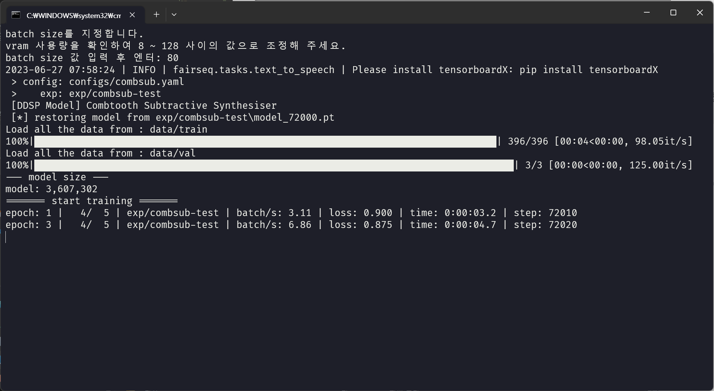
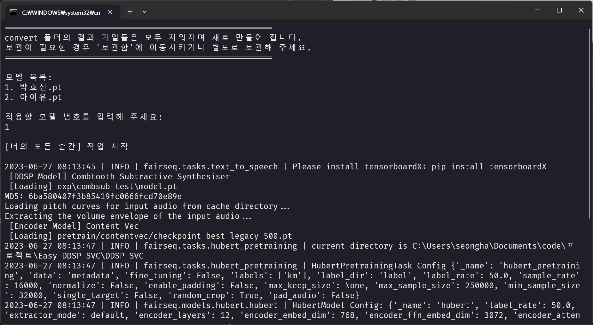

# Easy-DDSP-SVC

---

## 보컬 AI 학습 프로젝트

비개발자가 쉽게 사용하도록 작성하였습니다.

## 테스트 환경

아래 환경 및 실행에 필요한 프로그램들이 설지되지 않은 환경에서 작성되었으며,\
다른 환경에서의 테스트는 진행되지 않았습니다.

- OS: Windows 11
- CPU: Intel
- GPU: GTX 40XX

## 시작하기

해당 repository를 내려받고 압축을 해제합니다.
[다운로드](https://github.com/azqazq195/Easy-DDSP-SVC/archive/refs/heads/master.zip)

### 실행 파일 목록

앞으로 사용할 실행 파일은 아래와 같습니다.

1. setup-programs
2. setup-audio-files
3. prepare-learning
4. learn-model
5. convert

### 간략 사용방법

1. `1. setup-programs.bat` 를 실행하여 필요한 프로그램을 다운받습니다.
2. voice 폴더에 하위 폴더를 생성하고 목소리만 분리된 파일을 넣습니다.
   `2. setup-audio-files` 를 실행합니다.
3. `3. prepare-learning` 를 실행하여 2번에서 준비된 폴더를 선택합니다.
4. `4. learn-model` 3번에서 설정한 파일들을 학습합니다.
5. convert 하위에 폴더를 생성하고 `vocal`, `instruments` 파일을 넣습니다.
   `DDSP-SVC/exp/combsub-test` 에서 학습한 모델들을 골라 `models` 에 넣어 줍니다.
   `5. convert` 를 실행합니다.
  
- model을 추가로 생성하고 싶은 경우 2 ~ 4 번 과정을 반복합니다.
- 이미 생성된 model을 사용하여 목소리를 변환시키려는 경우 5번 과정을 진행합니다.

</img>

### 1. setup-programs

DDSP-SVC에 필요한 프로그램들을 설치합니다.
`1. setup-programs.bat` 을 실행하거나 아래 링크를 통해 다운로드 및 설치를 진행합니다.

아래 링크를 통해 다운받는 경우 아래 설명을 참조하시고, `bat` 파일을 통해 설치하는 경우 `bat` 파일의 설명을 따라 설치합니다.

CUDA 버전 확인 및 Visual Studio 설치 문제 등으로 직접 설치하는 것이 좋으나 자신의 PC 환경이 테스트 환경과 같거나 잘 모르는 경우 `bat` 파일을 통해 설치해 주세요.

프로그램 설치 (약 7 GB)

- [Nvidia CUDA 11.8](https://developer.nvidia.com/cuda-11-8-0-download-archive)
- [Microsoft Visual Studio 2022 Build Tools](https://visualstudio.microsoft.com/ko/visual-cpp-build-tools)
    </img>

- [Python 3.9](https://www.python.org/downloads/release/python-3913/)

파일 다운로드 (약 2 GB)

- [FFmpeg](https://ffmpeg.org/download.html)
  - 다운로드 후 압축 해제
  - 폴더 위치: `Easy-DDSP-SVC\DDSP-SVC\ffmpeg`
  
- [hubert](https://github.com/bshall/hubert/releases/download/v0.1/hubert-soft-0d54a1f4.pt)
  - 다운로드 후 파일 이동
  - 파일 위치: `Easy-DDSP-SVC\DDSP-SVC\pretrain\hubert`

- [nsf_hifigan](https://github.com/openvpi/vocoders/releases/download/nsf-hifigan-v1/nsf_hifigan_20221211.zip)
  - 다운로드 후 파일 이동
  - 폴더 위치: `Easy-DDSP-SVC\DDSP-SVC\pretrain\nsf_hifigan`
- [contentvec](https://ibm.ent.box.com/s/z1wgl1stco8ffooyatzdwsqn2psd9lrr)
  - 다운로드 후 파일 이동
  - 폴더 위치: `Easy-DDSP-SVC\DDSP-SVC\pretrain\contentvec`

Python 환경 구성 (약 5 GB)

링크를 통해 파일을 다운로드 및 설치한 경우 python 환경 구성은 아래 파일을 실행하여 설치해 주세요.

- `python-settings.bat`

### 2. setup-audio-files

> `voice` 폴더에 하위 폴더를 생성하고 **목소리** 만 분리된 파일을 위치 시킵니다.
> `2. setup-audio-files.bat` 을 실행합니다.

해당 파일은 아래와 같은 동작을 진행합니다.

1. 준비한 파일을 `fram_rate=44100, format=wav` 파일로 변환합니다.
2. 음성파일의 공백을 제거합니다.
3. 음성파일을 15초 길이로 분할합니다.

폴더 이름 및 음성파일의 이름은 상관없습니다.
작성자는 모델을 분리하기 위해 폴더 이름을 사람 이름으로 하였습니다.

```shell
voice
 ㄴ 아이유
   ㄴ voice1.mp3
   ㄴ voice2.mp3
 ㄴ 박효신
    ...
```

해당 작업이 완료된 후 공백이 제거된 `voice-source` 파일과 15초 간격으로 분리된 `voice-source-splited` 파일이 생성됩니다.

```shell
voice
 ㄴ 아이유
   ㄴ voice1.mp3
   ㄴ voice2.mp3
 ㄴ 박효신
    ...

voice-source
 ㄴ 아이유
   ㄴ voice1.wav
   ㄴ voice2.wav
 ㄴ 박효신
    ...

voice-source-splited
 ㄴ 아이유
   ㄴ voice1_1.wav
   ㄴ voice1_2.wav
   ㄴ voice1_3.wav
   ㄴ voice1_4.wav
   ㄴ voice2_1.wav
   ㄴ voice2_2.wav
   ㄴ voice2_3.wav
   ㄴ voice2_4.wav
 ㄴ 박효신
    ...
```

### 3. prepare-learning

> model을 학습하기 위하여 2번에서 작업한 voice 폴더들 중 하나를 선택합니다.
> 이 과정에서 이전에 학습한 model 파일들은 삭제되니 `models` 폴더에 백업해 주세요.

해당 파일은 아래와 같은 동작을 진행합니다.

1. 이전에 작업한 모델들이 있다면 제거합니다.
2. voice 파일들을 `DDSP-SVC` 하위의 필요한 폴더로 이동시킵니다.
3. 적절한 voice를 선별합니다.

</img>

### 4. learn-model

> `3. prepare-learning`에서 준비한 voice를 학습하여 model을 생성합니다.

- batch-size는 적절히 넣어 보고 GPU 램 사용량을 90% 정도로 잡아주세요.
- 2000 step마다 저장되며 `4. learn-model.bat`을 재 실행한 경우 저장된 곳 부터 다시 학습합니다.
- `ctrl + C` 로 학습을 종료할 수 있습니다.
- 작업결과물: `Easy-DDSP-SVC\DDSP-SVC\exp\combsub-test` 하위의 model_xxxx.pt

</img>

### 5. convert

> 4 번에서 작업한 모델로 음성을 변환합니다.
> 위에서 작업한 모델들 중 원하는 파일을 `Easy-DDSP-SVC\models` 으로 이동 시킵니다.
> convert 폴더 하위에 폴더를 만들고 변환할 vocal 과 instruments 파일을 넣습니다.
> `5. convert.bat` 을 실행합니다.

4 번에서 학습한 모델들은 `Easy-DDSP-SVC\DDSP-SVC\exp\combsub-test` 경로에 저장됩니다.
step 마다 model_20000.pt, model_40000.pt 등으로 저장됩니다.

이 파일들을 `Easy-DDSP-SVC\models` 으로 이동시킵니다.
이때, 이름을 변경해도 상관없습니다. 위의 예제로 `아이유` voice를 학습시켰다면 `아이유.pt` 으로 저장해 두고 추후에 `박효신` voice를 학습시켰다면 `박효신.pt` 으로 변경하여 `Easy-DDSP-SVC\models` 에 작업물을 보관합니다.

```shell
models
 ㄴ 아이유.pt
 ㄴ 박효신.pt
    ...
```

이제 학습한 모델을 익힐 `vocal`, `instruments`을 convert 폴더 하위에 폴더를 만들어 넣습니다.
이때 여러 곡을 한번에 변환할 수 있습니다.
**폴더 이름에는 제한이 없지만 `vocal`, `instruments` 파일은 이름을 그대로 지정해야합니다.**

``` shell
convert
 ㄴ 너의 모든 순간
   ㄴ vocal.mp3
   ㄴ instruments.mp3
 ㄴ 안녕 나의 사랑
   ㄴ vocal.mp3
   ㄴ instruments.mp3
 ㄴ 거리에서
   ㄴ vocal.mp3
   ㄴ instruments.mp3
    ...
```

</img>

변환 후 결과물들은 convert 폴더에 저장됩니다.

``` shell
convert
 ㄴ 너의 모든 순간
   ㄴ vocal.mp3
   ㄴ instruments.mp3
 ㄴ 안녕 나의 사랑
   ㄴ vocal.mp3
   ㄴ instruments.mp3
 ㄴ 거리에서
   ㄴ vocal.mp3
   ㄴ instruments.mp3
 ㄴ 너의 모든 순간.wav
 ㄴ 안녕 나의 사랑.wav
 ㄴ 거리에서.wav
    ...
```

`5. convert.baat` 실행 시 convert 하위에 존재하지 않는 폴더의 작업결과물은 삭제되니 변환 후 결과물들은 백업해 주세요.

### 끝으로

voice 폴더에 자신의 assets 을 계속 추가하고 학습하여 model 들을 쌓아가기 위해 만들었습니다.
`3. prepare-learning` 에서 새로운 모델을 학습하기 전에 `Easy-DDSP-SVC\DDSP-SVC\exp\combsub-test` 하위 파일의 백업만 주의해 주세요.

---

언어: [English](/DDSP-SVC/README.md) [简体中文](/DDSP-SVC/cn_README.md) **한국어**

# DDSP-SVC

<div align="center">
</img>
</div>
DDSP(차별화 가능한 디지털 신호) 기반 실시간 신경망 처리 노래 음성 변환 시스템

## 0. 소개

DDSP-SVC는 새로운 오픈 소스 노래 음성 변환 프로젝트이며 개인 컴퓨터에서 대중화할 수 있는 무료 AI 음성 변환 소프트웨어 개발에 전념합니다.

이 프로젝트보다 더 유명한 [Diff-SVC](https://github.com/prophesier/diff-svc)와 [SO-VITS-SVC](https://github.com/svc-develop-team/so-vits-svc)랑 비교해보았을때, 훈련과 합성 과정에서 조금 더 낮은 컴퓨터 사양에서도 동작하고 훈련 시간도 몇 배 더 단축 할 수 있습니다. 또한 실시간으로 음성을 변경 할 때 SO-VITS-SVC에서 요구하는 하드웨어 자원보다 요구 기준이 낮으며 Diff-SVC의 경우 실시간 음성 변경이 너무 느립니다.

본래 DDSP 의 합성 품질이 그닥 이상적이지는 않지만 (훈련 중에 TensorBoard에서 본래의 출력을 들을 수 있음) 사전훈련된 보코더 기반 enhancer를 사용하여 몇몇 데이터셋이 SO-VITS-SVC의 음질과 비슷한 수준으로 도달 할 수 있습니다.

학습 데이터의 품질이 매우 높은 경우에도 Diff-SVC의 음질이 가장 좋을 수 있습니다. 데모 출력 결과는 `samples` 폴더에 존재하며 관련된 체크포인트 모델들은 Releases 페이지에서 다운로드 하실 수 있습니다.

경고: DDSP-SVC를 통해 학습시키는 모델이 **합법적으로 허가된 데이터**로 학습되도록 해주시고 불법적인 방식으로 음성을 합성하여 사용하는 일이 없도록 해주세요. 본 저장소의 소유자는 모델 체크포인트와 오디오 이용한 권리 침해, 사기 및 기타 불법 행위에 대해 책임을 지지 않습니다.

## 1. 의존성 설치하기

우선 PyTorch를 [**공식 웹사이트서**](https://pytorch.org/) 설치하는것을 권장드립니다. 이후 다음 명령을 실행해주세요:

```bash
pip install -r requirements.txt 
```

안내 : 윈도우 기준 Python 3.8 + torch 1.9.1 + torchaudio 0.6.0 버전에서 테스트 되었습니다. 너무 최신 버전이거나 구 버전의 의존성일 경우 동작하지 않을 수 있습니다.

^ 업데이트: 윈도우 기준 Python 3.8 + cuda 11.8 + torch 2.0.0 + torchaudio 2.0.1 에서 동작하고, 학습 속도가 더 빠릅니다!

## 2. 사전 훈련된 모델 준비하기

업데이트:  ContentVec 인코더가 이제 지원됩니다. HubertSoft 인코더 대신 [ContentVec](https://ibm.ent.box.com/s/z1wgl1stco8ffooyatzdwsqn2psd9lrr) 인코더를 다운로드 하고 설정 파일을 수정하여 사용하실 수 있습니다.

- **(요구됨)** 사전 훈련된 [**HubertSoft**](https://github.com/bshall/hubert/releases/download/v0.1/hubert-soft-0d54a1f4.pt) 인코더를 다운로드 하고 `pretrain/hubert` 폴더에 저장합니다..
- 사전 훈련된 보코더 기반 enhancer를 [DiffSinger 커뮤니티 보코더 프로젝트](https://openvpi.github.io/vocoders)에서 다운로드하여 `pretrain/` 폴더에 압축을 풀어주세요.

## 3. 전처리 작업

학습시킬 데이터셋 (.wav 형식의 오디오 클립)을 `data/train/audio` 폴더에 넣어주세요.

검증할 데이터셋 (.wav 형식의 오디오 클립, 위 데이터셋에서 퀄리티가 괜찮은 데이터들)을 `data/val/audio` 폴더에 넣어주세요.

또한,

```bash
python draw.py
```

를 실행 하여 검증 데이터셋을 선택할 수 있습니다. (`draw.py`의 매개변수를 조정하여 압축 해제한 파일들과 다른 매개변수들을 수정할 수 있습니다.)

Combtooth substractive synthesiser (**권장됨**)를 이용해 전처리를 한다면 다음을 실행합니다:

```bash
python preprocess.py -c configs/combsub.yaml
```

또는 Sinusoids additive synthesiser를 이용해 전처리를 한다면 다음을 실행합니다:

```bash
python preprocess.py -c configs/sins.yaml
```

전처리 이전에 `config/<모델 이름>.yaml`에 위치한 설정 파일을 수정하실 수 있습니다. 기본 설정은 GTX-1660 그래픽 카드로 44.1khz 샘플링 속도 synthesiser를 이용하는데 적합하게 되어있습니다.

안내 1: 모든 오디오 클립의 샘플링 속도를 yaml 설정 파일에서 설정한 속도와 동일하게 유지해주세요! 동일하지 않을 경우 프로그램은 동작하나 샘플링 속도를 변환하는 과정에서 속도가 느려집니다.

안내 2: 학습 데이터셋의 오디오 클립 갯수는 (분할한다는 기준으로) 1000개 정도가 권장됩니다. 긴 오디오 파일의 경우 여러 파일로 분할하여 넣는다면 학습 속도는 향상되나 모든 오디오 파일의 길이가 2초 이하이면 안됩니다. 오디오 파일이 너무 많은 경우 메모리 용량이 많아야 하며 메모리 용량이 부족한 경우 'cache_all_data'를 false로 바꿈으로써 이 문제를 해결해 볼 수 있습니다.

안내 3: 검증 데이터셋의 오디오 클립 갯수는 10개 정도가 권장됩니다. 검증 데이터셋이 너무 많을 경우 검증 과정에서 속도가 느려지니 조절해서 넣어주세요.

안내 4: 데이터셋이 높은 품질이 아닐 경우 설정 파일에서 'f0_extractor'를 'crepe'로 설정해주세요. Crepe 알고리즘은 소음 억제에 특화되어 있으나 데어터 전처리 과정에서 많은 시간을 필요로 합니다.

업데이트: 다중 Speaker 학습을 이제 지원합니다. 설정 파일의 'n_spk' 매개변수가 다중 Speaker 모델인지를 제어합니다. **다중 Speaker** 모델로 학습하고 싶은신 경우 음성 폴더 이름이 **양수여야 하며 Speaker의 ID를 대표하는 'n_spk'의 수보다 크면 안됩니다.** 폴더 구조는 아래와 같습니다:

```bash
# 학습 데이터셋
# 첫번째 Speaker
data/train/audio/1/aaa.wav
data/train/audio/1/bbb.wav
...
# 두번째 Speaker
data/train/audio/2/ccc.wav
data/train/audio/2/ddd.wav
...

# 검증 데이터셋
# 첫번째 Speaker
data/val/audio/1/eee.wav
data/val/audio/1/fff.wav
...
# 두번째 Speaker
data/val/audio/2/ggg.wav
data/val/audio/2/hhh.wav
...
```

'n_spk' = 1인 경우 **1인 Speaker** 모델에 대한 폴더 구조도 지원하며 다음과 같습니다:

```bash
# 학습 데이터셋
data/train/audio/aaa.wav
data/train/audio/bbb.wav
...
# 검증 데이터셋
data/val/audio/ccc.wav
data/val/audio/ddd.wav
...
```

## 4. 학습시키기

```bash
# combsub 모델을 학습시킨다는 예
python train.py -c configs/combsub.yaml
```

다른 모델들을 학습할 때에도 명령은 비슷합니다.

중도에 학습을 일시 중단 하셔도 안전하며 동일한 명령을 입력해 다시 학습을 이어가실 수 있습니다.

학습 진행 도중 일시 중단하여 새 데이터 세트를 처리하거나 학습 매개변수를 변경한 뒤 (batchsize, lr 등) 동일한 명령을 입력해 모델을 세밀하게 조정하실 수 있습니다.

## 5. 시각화

```bash
# TensorBoard를 이용해 학습 상태 확인하기
tensorboard --logdir=exp
```

테스트 음성 샘플들은 첫 검증 이후 TensorBoard에 표시됩니다.

안내: TensorBoard에 표시되는 테스트 음성 샘플들은 DDSP-SVC 모델을 통한 출력물이며 Enhancer를 통해 향상된 음성이 아닙니다. Enhancer를 사용하고 합성 결과물을 테스트 하고 싶으신 경우 아래 내용에 설명된 기능들을 사용해주세요.

## 6. 비실시간 음성 변환을 할 경우

(**추천됨**) 사전 학습된 보코더 기반 Enhancer를 이용해 출력 결과를 향상시키기:

```bash
# enhancer_message_key = 0(기본값)인 경우 일반 음성 범위에서 높은 오디오 품질을 사용합니다.
# enhancer_adaptive_key 을 0 이상으로 설정하여 Enhancer를 더 높은 음역으로 적용시킵니다.
python main.py -i <입력.wav> -m <모델파일.pt> -o <출력.wav> -k <키 변경 (반음)> -id <speaker 아이디> -eak <enhancer_adaptive_key (반음)>
```

DDSP의 날(Raw) 출력물:

```bash
# 빠르지만 상대적으로 낮은 품질 (TensorBoard에서 들으시는것과 비슷합니다.)
python main.py -i <입력.wav> -m <모델파일.pt> -o <출력.wav> -k <키 변경 (반음)> -id <speaker 아이디> -e false
```

f0 추출과 응답 임계값에 대한 기타 옵션은 도움말을 참고해주세요.

```bash
python main.py -h
```

(업데이트) 다중 Speaker가 이제 지원됩니다. "-mix" 옵션을 사용하여 여러분들의 음색을 디자인하실 수 있으며 아래는 예시입니다:

```bash
# 첫번째 Speaker와 두번째 Speaker의 음색을 0.5, 0.5 비율로 혼합합니다
python main.py -i <입력.wav> -m <모델파일.pt> -o <출력.wav> -k <키 변경 (반음)> -mix "{1:0.5, 2:0.5}" -eak 0
```

## 7. 실시간 음성 변환을 할 경우

다음 명령을 이용해 간단한 GUI를 실행합니다:

```bash
python gui.py
```

프론트엔드에서는 슬라이딩 윈도우, 크로스 페이딩, SOLA 기반 스플라이싱 및 contextual semantic 참조와 같은 기술을 사용하여 짧은 대기 시간과 리소스 점유로 비실시간 합성에 가까운 음질을 달성할 수 있습니다.

업데이트: Phase 보코더 기반의 스플라이싱 알고리즘이 추가되었으나 대부분의 경우 SOLA 알고리즘이 이미 스플라이싱 음질이 충분히 높아 기본적으로 비활성화 되어있습니다. 극도의 저지연 실시간 음질을 추구하신다면 활성화 하여 매개변수를 신중하게 조정해볼 수 있으며 음질이 더 높아질 가능성이 있습니다. 그러나 여러 테스트에서 크로스 페이드 시간이 0.1초보다 길면 Phase 보코더가 음질을 크게 저하시키는 것을 확인하였습니다.

## 8. 참고

- [ddsp](https://github.com/magenta/ddsp)

- [pc-ddsp](https://github.com/yxlllc/pc-ddsp)
- [soft-vc](https://github.com/bshall/soft-vc)
- [DiffSinger (OpenVPI version)](https://github.com/openvpi/DiffSinger)
